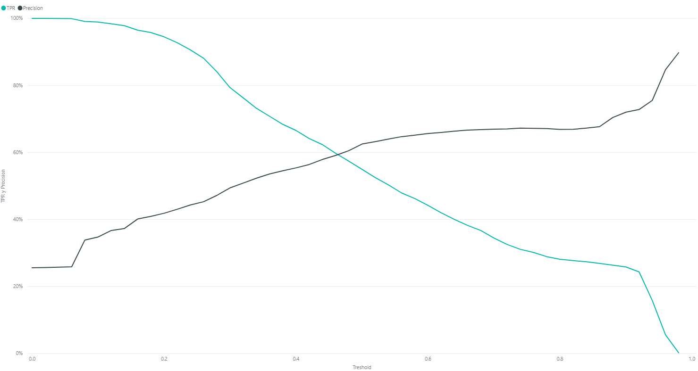
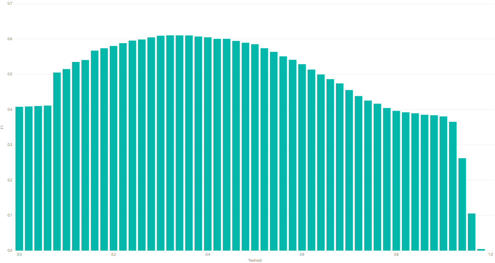
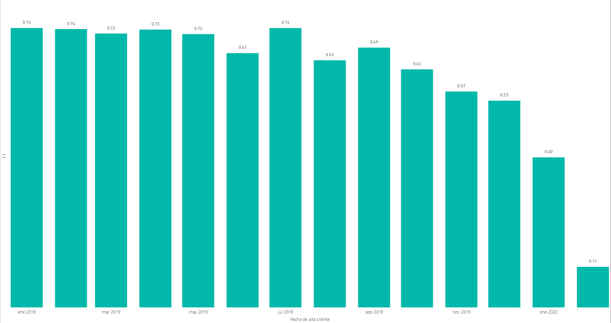

Data Challenge 2
----------------------

Table of contents (up to date)
- [1. Descripción de proyecto y objetivo](#1-descripción-de-proyecto-y-objetivo)
- [2. Cararísticas técnicas](#2-cararísticas-técnicas)
  - [2.1. Lenguajes de programación](#21-lenguajes-de-programación)
  - [2.2. Librerías de Python:](#22-librerías-de-python)
  - [2.3. Framework de computación en clúster](#23-framework-de-computación-en-clúster)
  - [2.4. IDE de ejecución de código](#24-ide-de-ejecución-de-código)
  - [2.5. Software de Visualización de datos](#25-software-de-visualización-de-datos)
- [3. Descripción de datos](#3-descripción-de-datos)
- [4. Carga, limpieza y división de datos](#4-carga-limpieza-y-división-de-datos)
- [5. Selección de variables](#5-selección-de-variables)
  - [5.1. Combinación variable numérica con variable numérica](#51-combinación-variable-numérica-con-variable-numérica)
  - [5.2. Combinación variable numérica con variable categórica](#52-combinación-variable-numérica-con-variable-categórica)
  - [5.3. Combinación variable categórica con variable categórica](#53-combinación-variable-categórica-con-variable-categórica)
- [6. Generación de modelos](#6-generación-de-modelos)
- [7. Entrenamiento y selección de modelos](#7-entrenamiento-y-selección-de-modelos)
- [8. Evaluación de modelo](#8-evaluación-de-modelo)
- [9. Conclusión](#9-conclusión)
- [10. Trabajo a futuro](#10-trabajo-a-futuro)
- [11. Contacto](#11-contacto)

# 1. Descripción de proyecto y objetivo

La prevención de lavado de dinero conlleva la investigación exhaustiva de casos sospechosos por parte de especialistas Para reducir la carga laboral y aumentar la proporción de casos sospechosos que finalmente resulten en una dictaminación positiva, los bancos deben identificar qué comportamientos, condiciones bancarias y demográficas incrementan la probabilidad de que el cliente haya cometido blanqueo de capitales.

En este proyecto utilizamos la riqueza informacional que se nos proporcionó sobre clientes y sus transacciones para explotarla a través de modelos de clasificación de Machine Learning que ayuden a identificar las variables más estrechamente asociadas con el lavado de dinero. 

# 2. Cararísticas técnicas

## 2.1. Lenguajes de programación

 - [Python 3.7](https://www.python.org/)

## 2.2. Librerías de Python:

- [Tensorflow 2.2.0](https://www.tensorflow.org)

    Uso para construcción de redes neuronales.

- [Pandas 1.0.3](https://pandas.pydata.org/)

    Uso para lectura y manipulación de los datos como objetos **DataFrame**.

- [NumPy 1.18](https://numpy.org/)

    Uso para modificación, identificación y manejo de los datos.

- [PySpark 2.4.5](https://spark.apache.org/docs/latest/api/python/index.html)

    Uso para obtención de datos estadísticos *T-Test* y prubeas de normalidad *Shapiro-Wilk*.

    Uso para selección de variables; procesamiento, imputación y trasformación de datos; entranmiento y selcción del modelo. (*Random Forest*, *Logistic Regression*)

- [functools 3.8](https://docs.python.org/3/library/functools.html)

    Uso para la unión de más de 2 DataFrames con la función *reduce*.

- [iterools 8.3.0](https://docs.python.org/2/library/itertools.html)

    Uso para realizar un producto de 2 parámetros para el entrenamiento tipo *GridSearch* de la red neuronal.

## 2.3. Framework de computación en clúster

- [Apache Spark 2.4.1](https://spark.apache.org)

## 2.4. IDE de ejecución de código

- [COLAB](https://colab.research.google.com/notebooks/intro.ipynb)

## 2.5. Software de Visualización de datos

- [Power BI](https://powerbi.microsoft.com/)

# 3. Descripción de datos

**BASEMODELO.csv** contiene registros de clientes que fueron evaluados para hacer la dictaminación de lavado de dinero. Incluye información demográfica, información bancaria del cliente, así como detalles de transacciones bancarias (montos y provenencias/destinos).

Los datos empleados se encuentran descritos a profundidad en el archivo situado en la ruta:

``` 
\SDATOOL-31455\Modelos\"Data Challenge - Caso 2"\"diccionario_data.xlsx"
```

# 4. Carga, limpieza y división de datos

La base de datos fue sometida al siguiente preprocesamiento. Registros que para el feature EDAD presentaran un valor negativo o igual o mayor a 100, se les imputó el valor nulo. 

Filas duplicadas fueron removidas, así como registros que no tuvieran el campo de identificación de cliente, CUST_INTRL_ID, informado. 

Para reducir el número de categorías del feature actividad económica (CD_ACT_GIRO, 1102 categorías), todos los registros con un código de actividad económica que figure menos de 1000 veces, fueron imputados con el valor "Otros". Otras features fueron simplemente removidas por tener demasiadas categorías (p. ej., CD_SUC_ALTA_CTE, con 5576 categorías)

Después de reordenar todos los registros de manera aleatoria, un quinto fue reservado para posteriormente evaluar las predicciones producidas por los modelos entrenados con los cuatro quintos restantes.

Para variables categóricas, los valores nulos fueron remplazados por "Missing" y para las numéricas fueron reemplazados por la mediana.

La división de features por tipo de variable está a cargo de la función ```split_columns_by_type```, la cual identifica los tipos numéricos (double, integer, long), categóricos (string), de fecha (timestamp) y binarias (byte).

# 5. Selección de variables

La selección de variables se llevó a cabo utilizando distintos métodos de filtraje dependiendo de la relación entre columnas y su tipo variable (numéricas, categóricas, etc.).

## 5.1. Combinación variable numérica con variable numérica

Coeficiente de correlación

Es una medida de dependencia lineal entre dos variables aleatorias cuantitativas. El valor del índice de correlación varía en el intervalo [-1,1], indicando el signo el sentido de la relación, y donde mayor sea el valor absoluto del índice de correlacion, existe más dependencia lineal.

En la selección de variables se emplea este índice eliminar una de cada par de variables que dependan en alto grado (valor absoluto del indice > 0.9), pues una de las dos no aportará información nueva al modelo.

## 5.2. Combinación variable numérica con variable categórica

Para determinar si el target (variable categórica) puede dividir los valores de variables numéricas en dos grupos con medias que diferentes de manera estadísticamente significante, empleamos la prueba t de Student como se muestra a continuación.

En este proyecto fijamos el umbral de significancia estadística en valores . Sólo las variables con valores distribuidos de manera gaussiana fueron sometidos a la prueba t de Student. La normalidad fue evaluada por medio de la prueba de Shapiro-Wilk.

La implicación de un valor  es que la variable numérica puede dividirse en dos grupos que difieren en su media y que están vinculados con uno de los dos valores del target. Esto sugiere que tal variable es útil para la predicción del target.

## 5.3. Combinación variable categórica con variable categórica

En este proceso se uso el método  el cual se seleccionan las variables con los mayores resultados en el test estadistico chi-squared que determina la dependencia entre variables y el objetivo; de esta manera se podrá validar si son independiente e irrelevantes para la clasificación.

En este ejemplo se obtuvieron aquellas variables cuyo valor p fuera mayor a 0.05 se desestimarían, ya que su significado estadístico es muy bajo y es irrelevante para el entrenamiento del modelo.

# 6. Generación de modelos

La generación de modelos se basó en el entrenamiento de **Random Forest**, **Logistic Regression** y **Neuronal Network** para un 80% del Dataset y un 20% para test.

El procesamiento previo a la introducción de los datos en el modelo (de ahora en adelante ***preprocessor***) consta de 4 etapas fundamentales para la transformación de los datos que se añadirán a un arreglo llamado *stages* que funcionará como parámetro para el *Pipeline* de transformación:

- ***Imputer***: Se imputaros valores de la mediana en datos vacíos para variables numéricas y la constante "*missing*" para variables categóricas.
``` python
cat_imputer = CategoricImputer(column_list = categoric_columns)
stages += [cat_imputer]

num_imputer = Imputer(inputCols= numeric_columns, outputCols=numeric_columns).setStrategy("median")
stages += [num_imputer]
```

- ***StandardScaler***: Estandariazción de datos de variables numéricas removiendo la media y escalando a la variación unitaria.
``` python
scaler = StandardScaler(inputCol = "numeric_columns", outputCol = "numeric_columns_scaled")
stages += [scaler]
```

- ***StringIndexer y OneHotEncoder***: Asignación de índices para cada categoría y aplicación del concepto de *OneHotEncoder* para varaibles categóricas.
``` python
for c in categoric_columns:
    stringIndexer = StringIndexer(inputCol = c, outputCol= c + "_index", handleInvalid= "keep")
    stages += [stringIndexer]

encoder = OneHotEncoderEstimator(inputCols= cat_cols_index, outputCols = cat_cols_enc)
stages += [encoder]
```

- ***VectorAssembler***: Vectorización de todas las variables resultantes de una sola columna llamada *features*.
``` python
assembler = VectorAssembler(inputCols = features, outputCol= "features")
stages += [assembler]
```

# 7. Entrenamiento y selección de modelos

Realizar pruebas con los modelos usando los mismos datos con los que fueron entrenados conduce a un sobreajuste de los parámetros, lo cual limita la aplicabilidad del algoritmo a datos nuevos.  

Para evaluar de manera realista los resultados del modelo aplicado a datos nuevos y evitar el sobreajuste se usó la técnica de validación cruzada de  dobleces. Este método crequiere la división de la base de datos de entrenamiento en  bases más pequeñas. El procedimiento consiste en realizar para cada doblez los pasos (1) entrenar el modelo usando  de los dobleces y (2) validar el modelo resultante usando el resto de los datos no contenidos en el set de datos de entrenamiento. Esto permite el cálculo de métricas de rendimiento como la accuracy, Área bajo la curva ROC o score F1, la cual se expresa en la media de los valores calculados durante el ciclo de validaciones.

Con el objetivo de identificar los hiperparámetros óptimos para los algoritmos de aprendizaje, se utilizó la búsqueda por rejilla (grid search), la cual consiste en una búsqueda exhaustiva dentro de un subconjunto del espacio de hiperparámetros. 

Para el modelo de regresión logística  los hiperparámetros a evaluar fueron: 
* Valores C (el inverso del nivel de regularización, donde valores menores especifican una regularización mayor) de ```[0.01, 0.001, 0.1, 1.0]``` 

Para el modelo de bosque aleatorio los hiperparámetros a evaluar fueron: 
* ``` [30, 50]``` como número de árboles de decisión por bosque para el algoritmo de random forest.     

Para el modelo de red neuronal *fully connected* los hiperparámetros a evaluar fueron:
* ``` [0.0, 0.1, 0.2]``` como la tasa de probabilidad de entrenamiento de un nodo de la Red Nueronal, conocido como *Dropout Rate*.
* ``` [0.1, 0.01, 0.001]``` como la tasa de regularización tipo *Ridge* conocidoc como **L2**.

La selección de parametros para cada modelo fue de [0.001 para el valor C] para regresión logística, [50 arboles de decisión] para bosque aleatorio y [0.0 para Dropout Rate y 0.0 para L2] para la red neuronal.

Como métrica para seleccionar el mejor modelo se utilizó el Área bajo la curva ROC, en la cual el modelo de regresión logísitca obtuvo un mejor puntaje (AUC ROC = 0.8639).

# 8. Evaluación de modelo

El modelo de regresión logística fue evaluado sobre datos no observados en ninguna etapa de su entrenamiento con un resultado de AUC = 0.8438

Un modelo puede desempeñarse de maneras distintas de acuerdo a el treshold de probabilidad seleccionado (para un clasificador binario se refiere al punto de inflexión de probabilidad en el cual se asinga un valor 1 cuando la probabilidad es mayor y un valor 0 cuando es menor). De la misma manera el desempeño del modelo seleccionado se puede medir de manera alternativa para un treshold dado a través de medidas como el score F1, Precision, Recall, etc. dependiendo de las necesidades del negocio.


<center><b>Figura 1.</b> True Positive Ratio en función de False Positive Ratio al variar tresholds de probabilidad.</center>

La Figura 1 nos muestra el costo-beneficio al intercambiar un aumento en True Positive Ratio por una disminución en False Positive Ratio al variar de un treshold de probabilidad a través de la visualización de los puntos de la curva ROC, brindando así una herramienta comparativa entre tresholds de fácil interpretación.


<center><b>Figura 2.</b> True Positive Ratio y Precisión en función del treshold de probabilidad</center>

En la Figura 2 se observa de manera complementaria el costo-beneficio que existe al intercambiar un aumento en el TPR a costa de disminuir la Precisión y viceversa. Para combinar el desempéño de un modelo en cuanto TPR y Precisión y una sola métrica es conveniente calcular el score F1.



<center><b>Figura 3.</b> Estadístico F1 en función del treshold de probabilidad.</center>

Si se desea conocer el treshold en el cual el costo beneficio de la Figura 2 es más óptimo, se pueden comparar los distintos tresholds a través de la gráfica del score F1 (Figura 3), la cual revela que el treshold más óptimo (de mayor valor F1) es el de 0.34. Para un treshold de 0.34, cualquier observación con una probabilidad de ser positivo mayor a 0.34 será categorizada como positiva.


<center><b>Figura 4.</b> Score F1 en función del mes de alta de los clientes. </center>

La Figura 4 muestra el desempeño del modelo para un treshold de 0.34 al medir el score F1 en función del mes de alta en el que fue dado de alta el cliente, se percibe una tendencia a obtener menores scores F1 para clientes con menor antiguedad.

Las 4 variables con mayor importancia en el modelo seleccionado son: *CTZSHP_CNTRY2_CD*, *CTZSHP_CNTRY1_CD*, *CD_OCUPACION* y *RES_CNTRY_CD*. Generar visualizaciones del desempeño del modelo en función de las variables de mayor importancia resulta conveniente para generar hipótesis de mejora en el modelo e interpretar causas de dicho desempeño.


<center><b>Figura 5.</b> True Positives y Score F1 en función de la variable CTZSHP_CNTRY1_CD.</center>

La Figura 5 ejemplifica una visualización sugerida para evaluar el impacto que tiene la una variable (en este caso CTZSHP_CNTRY1_CD) sobre el desempeño del modelo. Mayor análisis y conocimiento del negocio se requieren para generar hipótesis al respecto.

Un Dashboard interactivo que contiene las visualizaciones mencionadas y complementarias se ubica en la ruta:

```
\SDATOOL-31455\Modelos\"Data Challenge - Caso 2"\"BASEMODELO_lr_prediction.pbix"
```

# 9. Conclusión

La interpretación y mejora de los resultados de un modelo predictivo está sujeta a un extenso conocimiento de negocio e iteración continua. Métricas como la Área bajo la curva ROC resultan útiles para comparar de manera olística el desempeño de modelos, pero para considerar un modelo apto en producción debe ser elegido un treshold de probabilidad óptimo de acuerdo a las necesidades de negocio (por ejemplo, ¿qué volumen de verdaderos positivos puedo manejar con mi operación? ¿cuál es el costo-beneficio de etiquetar un cliente de manera incorrecta?).

En el modelo descrito en el presente documento, se sugieren visualizaciones y méticas que pueden resultar útiles para llevar a cabo esta labor.

# 10. Trabajo a futuro

Sin duda se podría hacer un trabajo mucho más exhaustivo en la exploración y análisis de los datos, así como la recopilación y agregación de fuentes de información que tengan relación con los datos. Algunos ejemplos para la recopilación de información de otras fuentes puede ser el uso de **web scrapping**, el cual se implementó de manera muy básica, pero podrían agregarse muchos más datos como el nivel socioeconómico y nivel de riesgo basado en su ubicación, valor de la moneda, temporada de alto o bajo gasto económico, información política y económica, etc. Esto puede ayudar bastante a determinar la relación de nueva información con la variable dependiente y mejorar los resultados del entrenamiento del modelo.

Para una mejora de la exploración de los datos para el entrenamiento del modelo se podrían implementar técnicas orientadas al **análisis descriptivo y dispersivo** (ANOVA) usando pruebas estadisticas como la desviación estándar y/o el rango intercuartil mostrados en gráficas para conocer más a fondo la relación, patrones y variación de los datos. Existe una herramienta llamada **Monte Carlo Simulation** la cual calcula el efecto de variables impredecibles en un factor específico. Otro ejemplo es el **Análisis Discriminatorio Lineal** (LDA) que utiliza variables continuas independientes y categóricas dependientes, el cual podría ser útil para obtener una combinación lineal de variables que logren caracterizar las clases y poder reducir algunas la dimensionalidad del data set dado que haciendo el *OneHotEncoding* de las categoricas, el data set crece bastante en columnas.

En cuanto a una mejora de la estructura del código se podría hacer modular por funciones y escalable a la agregación y adaptación de nuevas herramientas.

# 11. Contacto

* Julio Sánchez González - <julio.sanchez.gonzalez@bbva.com>
* Luis Enrique García Orozco - <luisenrique.garcia.orozco@bbva.com>
* Uri Eduardo Ramírez Pasos - <urieduardo.ramirez.contractor@bbva.com>
