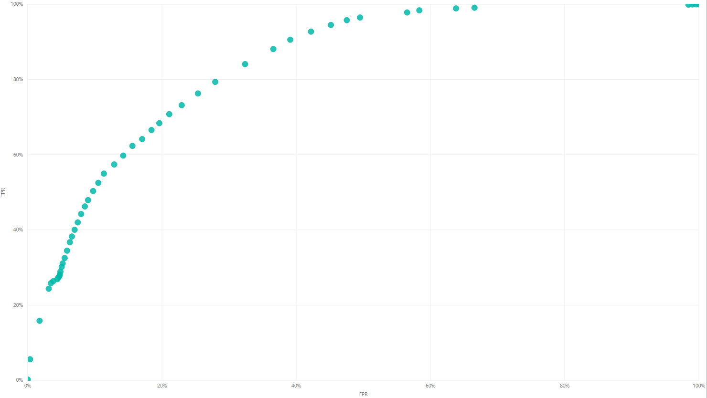
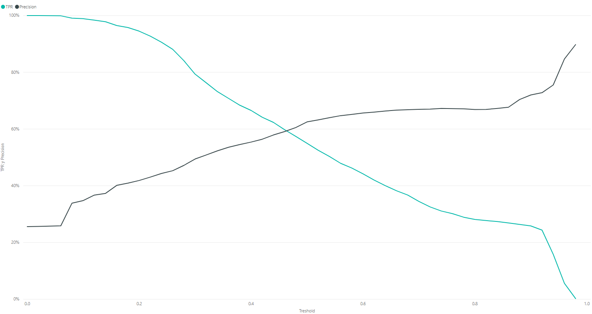
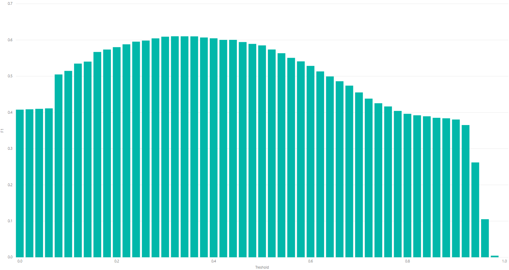
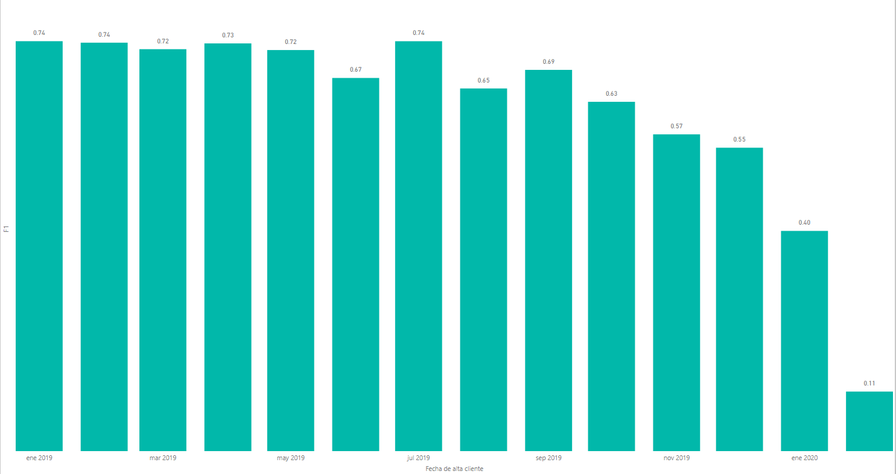
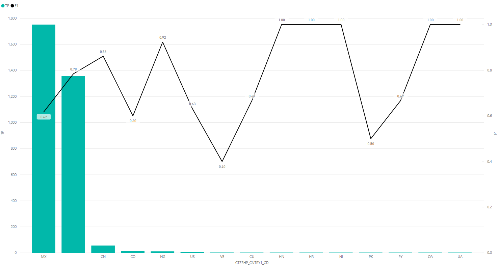

Data Challenge 2
----------------------

Table of contents (up to date)
- [Descripción](#descripción-de-proyecto-y-objetivo)
- [Selección de variables](#15-selección-de-variables)

# 1. Descripción de proyecto y objetivo

Los créditos que ofrecen los bancos varían ampliamente por tasa, importe y plazo. Para incrementar el rendemiento de préstamos crediticios, los bancos deben identificar qué condiciones bancarias y demográficas incrementan la probabilidad de que el cliente acepte una oferta de crédito. 

En este proyecto utilizamos la riqueza informacional que BBVA Perú proporciona sobre clientes y sus transacciones para explotarla a través de modelos de clasificación de Machine Learning que ayuden a identificar las condiciones de préstamo bajo las que un cliente aceptará una oferta crediticia. 

# 2. Cararísticas técnicas

## 2.1. Lenguajes de programación

 - [Python 3.7](https://www.python.org/)

## 2.2. Librerías de Python:

- [Pandas 1.0.3](https://pandas.pydata.org/)

    Uso para lectura y manipulación de los datos como objetos **DataFrame**.

- [NumPy 1.18](https://numpy.org/)

    Uso para modificación, identificación y manejo de los datos.

- [Pyspark FALTA VERSION](FALTA LINK)

    Uso para obtención de datos estadísticos *T-Test* y prubeas de normalidad *Shapiro-Wilk*.
    Uso para selección de variables; procesamiento, imputación y trasformación de datos; entranmiento y selcción del modelo. (*Random Forest*, *Logistic Regression*)

- [functools FALTA VERSION](FALTA LINK)

    Uso para obtención de datos estadísticos *T-Test* y prubeas de normalidad *Shapiro-Wilk*.

- [iterools FALTA VERSION](FALTA LINK)

## 2.3. IDE de ejecución de código

- [Anaconda - Spyder 4.0](https://www.spyder-ide.org/)

## 2.4. Software de Visualización de datos

- [Power BI](FALTA LINK)

# 3. Descripción de datos

Los datos empleados se encuentran descritos a profundidad en el archivo situado en la ruta:

``` 
\SDATOOL-31455\Modelos\"Data Challenge - Caso 2"\"diccionario_data.xlsx"
```

Los datos empleados se encuentran en la ruta:

``` 
\SDATOOL-31455\Modelos\"Data Challenge - Caso 2"\"diccionario_data.xlsx"
```

# 4. Carga y unión de datos

Los datos de las tablas descritas en la sección Descripción de datos fueron unidos en una tabla 
de granularidad - mes de cotización / código de cliente.

En caso de que existieran registros repetidos para la combinación -mes de cotización /código de cliente- se generaron distintos tipos de agregaciones de acuerdo a el tipo de variable.

## 4.1. Variables Categóricas

Conteo de cantidad de registros de cada valor de la variable. Por ejemplo, si en un mismo mes de cotización para un mismo cliente se tienen dos solicitudes con garantía "A" y una solicitud con garantía "B", se genera una columna llamada "garantia_A_cnt" con valor de 2 y una columna llamada "garantia_B_cnt" con valor de 1. El resto de columnas generadas para el resto de valores observados se mostrarán como 0.

## 4.2. Variables Numéricas

Promedio, máximo y mínimo de los valores observados para dicha la variable. Por ejemplo, si en un mismo mes de cotización para un mismo cliente se tienen dos importes uno con valor de 200 y otro con valor de 300, se generarán las columnas "importe_avg" con valor de 250, "importe_max" con valor de 300 e "importe_min" con valor de 200. Cuando no existen observaciones se mostrará 0 en todas las columnas.

## 4.3. Variable Dependiente (Categórica):

Como se desea conservar la variable con valores de 1 y 0 únicamente, cuando aparecen dos solicitudes indistinguibles el mismo mes, se combinan en una sola solicitud que toma el valor de 1 si alguna de las dos fue aceptada y de 0 si ninguna lo fue. Adicionalmente se crea una columna con la cantidad de solicitudes encontradas para la el mismo mes de cotización para un mismo cliente.

# 5. Selección de variables

## 5.1. Combinación variable numérica con variable numérica

Coeficiente de correlación

Es una medida de dependencia lineal entre dos variables aleatorias cuantitativas. El valor del índice de correlación varía en el intervalo [-1,1], indicando el signo el sentido de la relación, y donde mayor sea el valor absoluto del índice de correlacion, existe más dependencia lineal.

En la selección de variables se emplea este índice eliminar una de cada par de variables que dependan en alto grado (valor absoluto del indice > 0.9), pues una de las dos no aportará información nueva al modelo.

## 5.2. Combinación variable numérica con variable categórica

Para determinar si el target (variable categórica) puede dividir los valores de variables numéricas en dos grupos con medias que diferentes de manera estadísticamente significante, empleamos la prueba t de Student como se muestra a continuación.

En este proyecto fijamos el umbral de significancia estadística en valores . Sólo las variables con valores distribuidos de manera gaussiana fueron sometidos a la prueba t de Student. La normalidad fue evaluada por medio de la prueba de Shapiro-Wilk.

La implicación de un valor  es que la variable numérica puede dividirse en dos grupos que difieren en su media y que están vinculados con uno de los dos valores del target. Esto sugiere que tal variable es útil para la predicción del target.

## 5.3. Combinación variable categórica con variable categórica

En este proceso se uso el método  el cual se seleccionan las variables con los mayores resultados en el test estadistico chi-squared que determina la dependencia entre variables y el objetivo; de esta manera se podrá validar si son independiente e irrelevantes para la clasificación.

En este ejemplo se obtuvieron aquellas variables cuyo valor p fuera mayor a 0.05 se desestimarían, ya que su significado estadístico es muy bajo y es irrelevante para el entrenamiento del modelo.
``` python
chi_scores = chi2(x,y)
p_values = pd.Series(chi_scores[1], index = x.columns)
droped_chi2_cols = p_values[p_values > 0.05].index.to_list()
```

# 6. Generación de modelos

La generación de modelos se basó en el entrenamiento de **Random Forest** y **Logistic Regression** para cada mes definido en un rango de fecha mínima y fecha máxima de la variable **MES_COTIZACION**. La información de entrenamiento *train* se define como toda aquella que sea anterior a la fecha seleccionada. La información de prueba *test* se define como la misma que se esté seleccionando:
``` python
for month in dt_range:   
    train_temp = train[train.MES_COTIZACION <= month]
    test_temp  = test[test.MES_COTIZACION == month]
```
Teniendo el subset de datos de entrenamiento, se procesaran en una etapa llamada ***preprocess*** definida en un *Pipeline*, el cual se divide en 3 etapas:
``` python
preprocessor = ColumnTransformer(
    transformers=[
        ("feature_select", feature_selector, droped_cols),
        ("cat", categorical_transformer, final_cat_cols),
        ('num', numeric_transformer, final_num_cols)
])
```

- ***feature_select***: Desestimación de variables que fueron designadas por la selección de variables como "poco informativas" para el entramiento del modelo. Se usaron cuatro métodos estadísticos:
    * Desestimación por porcentaje de nulos.
    * Desestimación por Coeficiones de Correlación de Pearson.
    * Desestimación por T-Test.
    * Desestimación por Chi^2.
``` python
dropped_cols = dropped_null_cols + dropped_corr_cols + dropped_ttest_cols + dropped_chi2_cols

feature_selector = Pipeline(steps = [
    ("dropper", MultiColumnDropper(dropped_cols))
])
```

- ***numeric_transformer***: Adpatación y ajuste de datos numéricos en dos etapas:
    * Imputación de la mediana a registros nulos.
    * Estandariazción de datos removiendo la media y escalando a la variación unitaria.
``` python
numeric_transformer = Pipeline(steps=[
    ('imputer', SimpleImputer(strategy='median')),
    ('scaler', StandardScaler())
])
```

- ***categorical_transformer***: Ajuste y codificación de datos categóricos en dos etapas:
    * Imputación de un valor constante *missing* a registros nulos.
    * Aplicar *OneHotEncoder* para cada categoría.
``` python
categorical_transformer = Pipeline(steps=[
    ('imputer', SimpleImputer(strategy='constant', fill_value='missing')),
    ('onehot', OneHotEncoder(handle_unknown = "ignore", sparse = False))
])
```

# 7. Entrenamiento y selección de modelos

Realizar pruebas con los modelos usando los mismos datos con los que fueron entrenados conduce a un sobreajuste de los parámetros, lo cual limita la aplicabilidad del algoritmo a datos nuevos.  

Para evaluar de manera realista los resultados del modelo aplicado a datos nuevos y evitar el sobreajuste se usó la técnica de validación cruzada de  dobleces. Este método crequiere la división de la base de datos de entrenamiento en  bases más pequeñas. El procedimiento consiste en realizar para cada doblez los pasos (1) entrenar el modelo usando  de los dobleces y (2) validar el modelo resultante usando el resto de los datos no contenidos en el set de datos de entrenamiento. Esto permite el cálculo de métricas de rendimiento como la accuracy, Área bajo la curva ROC o score F1, la cual se expresa en la media de los valores calculados durante el ciclo de validaciones.

Con el objetivo de identificar los hiperparámetros óptimos para los algoritmos de aprendizaje, se utilizó la búsqueda por rejilla (grid search), la cual consiste en una búsqueda exhaustiva dentro de un subconjunto del espacio de hiperparámetros. 

Para el modelo de regresión logística  los hiperparámetros a evaluar fueron: 
* Valores C (el inverso del nivel de regularización, donde valores menores especifican una regularización mayor) de ```[0.01, 0.001, 0.1, 1.0]``` 

Para el modelo de bosque aleatorio los hiperparámetros a evaluar fueron: 
* ``` [30, 50]``` como número de árboles de decisión por bosque para el algoritmo de random forest.     

Para el modelo de red neuronal *fully connected* los hiperparámetros a evaluar fueron: 
* ``` [ ]``` FALTA

La selección de parametros para cada modelo fue de [X = FALTA, ] para regresión logística, [50 arboles de decisión] para bosque aleatorio y [FALTA ] para la red neuronal.

Como métrica para seleccionar el mejor modelo se utilizó el Área bajo la curva ROC, en la cual el modelo de regresión logísitca obtuvo un mejor puntaje (AUC ROC = FALTA).

# 8. Evaluación de modelo

El modelo de regresión logística fue evaluado de manera olística sobre datos no observados en ninguna etapa de su entrenamiento con un resultado de AUC = 0.8438

El desempeño del modelo seleccionado se puede medir de manera alternativa para un treshold dado a través de medidas como el score F1, Precision, Recall, etc. dependiendo de las necesidades del negocio. 



La Figura 1 nos muestra el costo-beneficio de la variación de un treshold a través de la visualización de los puntos de la curva ROC, brindando así una herramienta comparativa de fácil interpretación.


Figura 2

En la Figura 2 se observa de manera complementaria el costo-beneficio entre la Precisión y el TPR.



Si se desea conocer el treshold en el cual el costo beneficio de la Figura 2 es más óptimo, se pueden comparar los distintos tresholds a través de la gráfica del score F1 (Figura 3), la cual revela que el treshold más óptimo (de mayor valor F1) es el de 0.34.

Para dicho treshold, cualquier observación con una probabilidad de ser positivo mayor a 0.34 será categorizada como positiva.



La Figura 4 muestra el desempeño del modelo para un treshold de 0.34 al medir el TPR en función del mes de alta en el que fue dado de alta el cliente, y cuenta con coloración determinada por la precisión, donde la escala de tipo semáforo corresponde a valores rojos para menor precisión y valores verdes para mayor precisión. 

Las 4 variables con mayor importancia en el modelo seleccionado son: *CTZSHP_CNTRY2_CD*, *CTZSHP_CNTRY1_CD*, *CD_OCUPACION* y *RES_CNTRY_CD*.



La Figura 5 ejemplifica una visualización sugerida para evaluar el impacto que tiene la una variable (en este caso CTZSHP_CNTRY1_CD) sobre el desempeño del modelo. Mayor análisis y conocimiento del negocio se requieren para generar hipótesis al respecto.

Un Dashboard interactivo con las visualizaciones mencionadas y complementarias se ubica en la ruta:

```
\SDATOOL-31455\Modelos\"Data Challenge - Caso 2"\"BASEMODELO_lr_prediction.pbix"
```

# 9. Conclusión

Los modelos utilizados presentan un AUC ROC demasiado bajo y un índice de Gini demasiado alto como para ponerlos en producción. Cabe destacar que el análisis de importancia arrojó variables relacionadas con el crédito hipotecario, las cuentas de fondos mutuo, las cuentas compensación por Tiempo de Servicio y el número de operaciones en dólares como los principales predictores de la decisión del cliente. Esto sugiere que el capital acumulado define si el cliente cuenta con el respaldo económico para tomar el riesgo que representan los créditos bancarios.


# 10. Trabajo a futuro

Sin duda se podría hacer un trabajo mucho más exhaustivo en la exploración y análisis de los datos, así como la recopilación y agregación de fuentes de información que tengan relación con los datos. Algunos ejemplos para la recopilación de información de otras fuentes puede ser el uso de **web scrapping**, el cual se implemento de manera muy básica, pero podrían agregarse muchos más datos como el nivel socioeconómico y nivel de riesgo basado en su ubicación, valor de la moneda, temporada de alto o bajo gasto económico, información política y económica, etc. Esto puede ayudar bastante a determinar la relación de nueva información con la variable dependiente y mejorar los resultados del entrenamiento del modelo.

Para una mejora de la exploración de los datos para el entrenamiento del modelo se podrían implementar técnicas orientadas al **análisis descriptivo y dispersivo** (ANOVA) usando pruebas estadisticas como la desviación estándar y/o el rango intercuartil mostrados en gráficas para conocer más a fondo la relación, patrones y variación de los datos. Existe una herramienta llamada **Monte Carlo Simulation** la cual calcula el efecto de variables impredecibles en un factor específico. Otro ejemplo es el **Análisis Discriminatorio Lineal** (LDA) que utiliza variables continuas independientes y categóricas dependientes, el cual podría ser útil para obtener una combinación lineal de variables que logren caracterizar las clases y poder reducir algunas la dimensionalidad del data set dado que haciendo el *OneHotEncoding* de las categoricas, el data set crece bastante en columnas.

En cuanto a una mejora de la estructura del código se podría hacer modular por funciones y escalable a la agregación y adaptación de nuevas herramientas.

# 11. Contacto

Julio Sánchez González - <julio.sanchez.gonzalez@bbva.com>

Luis Enrique García Orozco - <luisenrique.garcia.orozco@bbva.com>

Uri Eduardo Ramírez Pasos - <urieduardo.ramirez.contractor@bbva.com>
